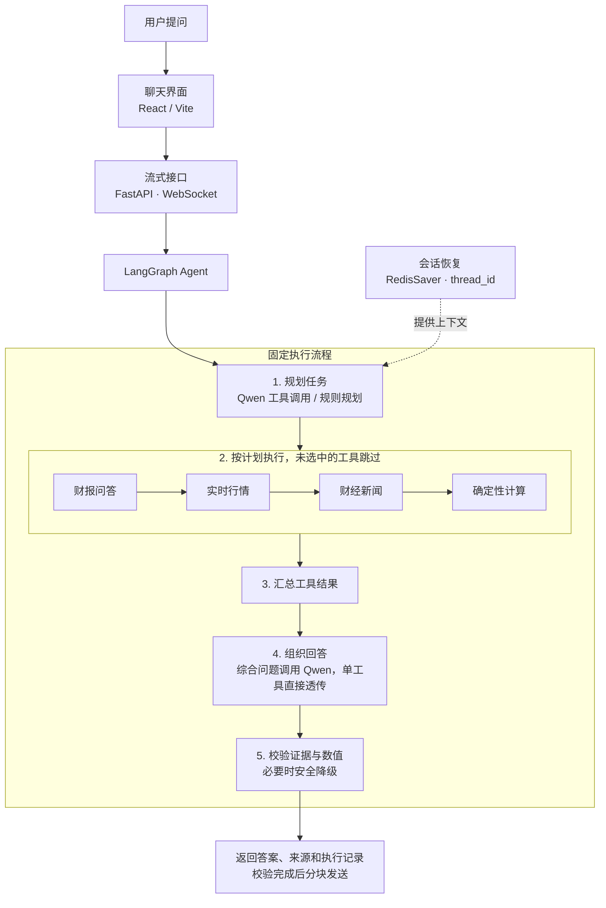
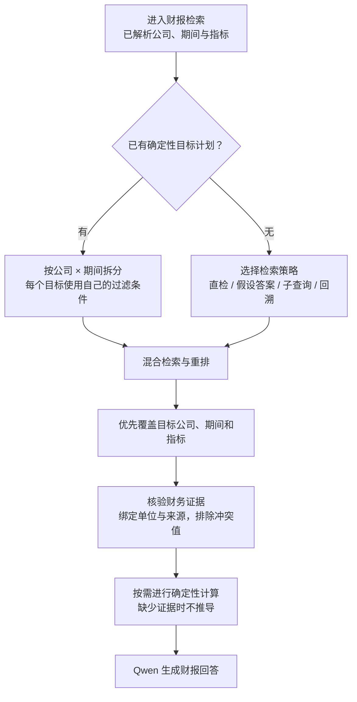

# Financial Agentic RAG

> A股上市公司财报智能问答 Agent

面向 A 股财报研究的单 Agent、多工具应用。它把冻结财报语料中的检索问答，与实时行情、财经新闻、确定性计算和多轮会话上下文放进同一条可观测链路：先确定用户到底在问哪家公司、哪个报告期和什么指标，再按证据边界回答，而不是把相似财报片段直接交给模型猜结论。

## Online Demo

[https://jinxi-ai.com](https://jinxi-ai.com) - Interactive Financial Agent Demo（GPU 按需运行，演示可用性取决于实例状态）

## Why This Project

财报问答的难点不只是“找到相似文本”。在多公司、多报告期查询中，普通 TopK 向量检索很容易把正确指标带到错误公司或错误期间：例如同一公司的半年报与年报文字高度相似，或两家公司都披露了相同指标。

本项目将查询中的公司、报告期和指标显式解析为可验证目标。对于多目标问题，系统按 `company × period` 定向检索并覆盖关键证据，最后才生成回答。这样把“检索命中”与“证据是否足以支持回答”分开处理，降低公司混淆、期间错配和数值幻觉。

## Key Features

- **面向财报的定向检索**：确定性提取公司、报告期与指标；多公司、多期间问题使用 `company × period` target planning。
- **Hybrid RAG**：BGE-M3 dense/sparse hybrid retrieval、Milvus、Parent-Child chunking、Parent dedup 和 `bge-reranker-large`。
- **结构化财务证据**：仅在公司、期间、指标和单位都明确时提取 verified values；差值、增长率与百分点变化由 deterministic calculator 完成。
- **Single Agent + multi-tool**：LangGraph 编排 Financial RAG、Market MCP、News MCP 与 Calculator，不是 Multi-Agent 或 A2A 架构。
- **一次性 Function Calling 规划**：支持 Rule / Qwen Function Calling 两种 Planner；原生 `tool_calls` 经本地参数校验后写入 AgentState，由固定 LangGraph workflow 执行。
- **多轮上下文**：RedisSaver 保存 thread session context；显式偏好使用隔离的 Redis namespace，普通提问不会隐式写入长期偏好。
- **安全降级与 Trace**：工具选择、工具执行和最终回答分层记录；外部数据失败时保留已验证结果并说明缺口，不编造价格、新闻或未验证计算。

## 系统架构

先看主线：**接收问题 → 规划任务 → 执行工具 → 汇总回答 → 校验后返回**。下图只展示这些阶段，规划、工具来源和检索细节分别放在后面的展开说明中。图源同步保存在 [docs/architecture.mmd](docs/architecture.mmd)。



前端实际连接 `WebSocket /api/agent/stream`；FastAPI 通过 `AgentStreamingAdapter` 调用 `LangGraphFinancialAgent`。实线是执行顺序，虚线仅表示会话上下文输入。四个工具节点按固定顺序经过，各自判断执行或跳过，不由 Planner 动态跳转。

**React 不等于 ReAct。** React / Vite 是前端技术；本项目是一次规划、固定流程执行，没有“模型调用工具 → 观察结果 → 再决定下一个工具”的自主循环，也不是多 Agent 架构。

<details>
<summary><strong>规划细节：Qwen 如何选工具，参数如何进入执行层？</strong></summary>

规划支持两个模式：规则模式由 `FinancialPlanner` 判断；Function Calling 模式让 Qwen 一次返回本轮工具调用。两者使用同一条 LangGraph 执行主线。

| 步骤 | 实际处理 |
|---|---|
| 准备上下文 | 当前问题、显式公司与期间、恢复的会话上下文、用户明确保存的偏好。当前显式目标优先。 |
| 提供工具定义 | `tool_schemas()` 描述四种工具及参数。FC 每轮规划最多一次模型请求，SDK 自动重试关闭。 |
| 接收原生调用 | Qwen 返回 `tool_calls`，包含工具名和参数；不是让模型输出一段自定义规划文本。 |
| 本地校验 | `validate_arguments()` 检查工具名、字段、公司/期间约束及计算输入；整份计划通过校验后才允许执行。 |
| 写入本轮状态 | `planned_calls` 保存校验后的调用；`required_tools` 保存所需工具类型；`intent` 保存意图，统一写入 `AgentState`。 |
| 交给固定节点 | 各节点只消费自己的调用；Market/News 可包含同名工具的多个公司目标，逐条执行，并非动态修改 Graph 边。 |

源码默认 `AGENT_PLANNER_MODE=rule`；v1.1 严格验收使用 `function_calling`、`qwen3.8-max`、`AGENT_PLANNER_FALLBACK_TO_RULE=false`。无工具计划或校验失败会返回说明/澄清；只有显式开启配置时，才允许回退到规则 Planner。

</details>

<details>
<summary><strong>四种工具：实际入口、数据来源与失败处理</strong></summary>

| 工具 | 调用链与边界 |
|---|---|
| 财报问答 | `financial_rag` 节点 → `FinancialRAGTool.run(query)` → `IntegratedQASystem.query()`。内部包含 FAQ、报告目录和财报检索。 |
| 实时行情 | `market` 节点 → `FinancialMCPClient` → stdio → Market MCP Server → `MarketProvider` → 东方财富；请求失败时尝试腾讯财经。MCP 工具名为 `get_market_snapshot`。 |
| 财经新闻 | `news` 节点 → 同一个 MCP Client → stdio → News MCP Server → `NewsProvider`。默认优先东方财富，无可靠结果时尝试新浪财经；Google News 保留为可选回退。MCP 工具名为 `search_financial_news`。 |
| 确定性计算 | `calculator` 节点 → `CalculatorTool`，只处理明确的计算输入；复合算式使用安全 AST 白名单，不执行任意代码。 |

行情/新闻服务是本地 **stdio 子进程**，不是独立部署的 MCP HTTP 服务。返回值保留成功/失败、来源和耗时；新闻还保留标题、URL 与发布时间。外部来源不可用时，后续回答说明缺口，不以其他数据冒充。

FAQ / BM25 / MySQL 不是第五个 Agent 工具，而是财报问答内部的快捷路径。

</details>

## 财报问答流程

财报工具内部先解析**公司、期间与指标**，再处理两类快捷回答：

- **金融定义**：尝试 FAQ 缓存、MySQL 精确匹配和 BM25；具体公司、期间或报告问题绕过通用 FAQ 匹配。
- **查找报告**：由 `ReportCatalog` 返回可用报告或期间说明，不必进入向量检索。

其余问题交给 `FinancialQueryRouter` 判断是否进入财报检索。下图从**已允许检索**的位置展开；范围外或没有检索证据时返回安全说明。



**这里的多目标拆分属于 Financial RAG 内部，不是外层工具规划。** 外层回答“用哪些工具”；这里回答“财报工具分别查哪些公司、哪些期间和哪些指标”。

<details>
<summary><strong>目标如何生成？为什么与 StrategySelector 分成两条路？</strong></summary>

1. `extract_query_metadata()` 从问题中提取公司、期间、指标，并构造候选 `SubQueryTarget`。
2. `IntegratedQASystem.query()` 在 FAQ/报告目录分流后，通过 `requires_deterministic_subqueries()` 判断是否启用确定性目标计划。
3. 满足条件时，把 `subquery_plan()` 和明确的“子查询检索”策略传给 `RAGSystem.generate_answer()`。每个目标包含查询文本及自己已解析出的 `company_code / report_period` 过滤条件。
4. RAG 入口仍先执行范围判断；允许检索后，`_retrieve_with_subqueries()` 直接消费已有目标，**不调用 StrategySelector，也不让 LLM 重新生成这些子查询**。
5. 没有预设策略时，才由 `StrategySelector` 选择直接检索、HyDE（假设答案）、LLM 子查询或回溯检索，保留适用的 metadata 过滤条件。

多公司、单一明确期间、未指定具体指标的宽泛经营比较，会在 metadata 层按公司展开**营业收入、归母净利润、经营活动现金流量净额**。精确指标查询不做这种展开，也不凭空补齐未指定的期间。

实际线上入口在 `rag_qa/core/new_rag_system.py`；旁边保留的旧 `rag_system.py` 不是这条请求链的入口。

</details>

<details>
<summary><strong>检索、证据与计算：完整执行顺序及冻结参数</strong></summary>

| 顺序 | 处理 | 实现与约束 |
|---|---|---|
| 1 | 查询编码 | BGE-M3 生成稠密与稀疏向量；多个子查询批量编码。 |
| 2 | 混合召回 | Milvus 对两路向量都应用当前目标的过滤条件，再用 `WeightedRanker` 融合，权重为稠密 0.7、稀疏 1.0，得到 Top-K 子块。 |
| 3 | 恢复原文 | 根据子块找回 Parent，并去重，避免同一原文反复占用上下文。 |
| 4 | 相关性重排 | 使用 `bge-reranker-large`（CrossEncoder）重排父块；多目标仍逐目标检索和重排，候选不足两条时无需重排。 |
| 5 | 覆盖优先选择 | 合并候选池，优先覆盖“公司/期间目标 × 指标”，再按已有排序补足上下文。 |
| 6 | 结构化证据 | 提取公司、期间、指标、金额/比率、单位和 `source_parent`，不混用公司口径与行业口径。 |
| 7 | 数值核验 | 统一单位，排除同一公司/期间/指标存在冲突的数值，生成 verified evidence block。 |
| 8 | 确定性计算 | 仅在用户要求且输入已验证时计算；当前支持同一公司、两个同类型期间的差值、增长率或百分点变化，缺证据则追加限制说明。 |
| 9 | 生成回答 | Parent 原文、已验证数值及来源、计算结果或缺证据约束共同进入 Qwen 财报回答 Prompt。 |

冻结 benchmark 使用 **K=30，M=3 为基础证据预算**，不是理论最优参数，也不是所有请求只能有三个 Parent。`_select_context_docs()` 在既有候选池中优先满足目标与指标覆盖，并按查询规模使用有上限的预算；增加预算不会自动补齐缺失证据。

此处的财务计算位于 RAG 内部，与外层处理用户已给数字的 `CalculatorTool` 是两层不同能力。

</details>

## 执行、校验与返回

真实节点顺序如下。未选中的工具跳过工作，但不会改变这条固定主线：

```text
START → plan → financial_rag → market → news → calculator
      → aggregation → synthesis → guardrail → END
```

| 阶段 | 实际行为 |
|---|---|
| 汇总结果 | 汇集本轮所有工具结果；单工具保留原回答或做确定性格式化，综合问题先形成安全摘要。 |
| 组织回答 | 单工具仍经过 `synthesis` 节点，但只透传 `draft_answer`，不额外调用 Agent 层 Qwen。综合问题才交给 `QwenSynthesizer`，输入包括各工具结果、证据约束、可用性、错误和会话上下文；失败时保留安全摘要。 |
| 校验与降级 | 检查证据一致性、工具可用性与来源、数值及单位。必要时替换为安全摘要；显式近似金额只有受限容差，不会对任意数字放行。当前跨工具数值支持检查以成功的 Financial RAG 结果为入口；规则保护不等于零幻觉保证。 |
| 返回前端 | 对外 Guardrail 状态来自最终 `AgentState`，映射为 `passed / degraded / error`，不能用“节点执行成功”代替“校验通过”。 |

**执行进度实时通知，最终答案校验后分块发送。** 财报工具先收集内部 RAG 输出，Agent 层综合生成使用 `stream=False`；完成 Guardrail 后再将最终文本切成 `token` 事件。因此，这不是 Qwen 原生 token 直接传到前端。单工具省略的是 Agent 层综合生成，不是 Financial RAG 内部的模型调用。

<details>
<summary><strong>WebSocket 事件与旧接口的区别</strong></summary>

| 时机 | 对外事件 |
|---|---|
| 开始与规划 | `start`、`plan` |
| 工具执行 | `tool_start`、`tool_end` |
| 综合生成开始 | `synthesis_start`，仅综合问题 |
| 完成校验后 | `guardrail`、`sources`、`trace`、`token`、`end` |
| 异常 | `error` |

React 的 `useAgentStream` 通过 `new WebSocket(...)` 连接 `/api/agent/stream`。`AgentStreamingAdapter` 负责上述事件和最终分块。原有 HTTP `/api/query`、旧 WebSocket `/api/stream` 仍保留，但不是 Agent Demo 的主链路。

</details>

### 记忆如何恢复

- **本轮会话**：`thread_id` 对应 RedisSaver / Redis Stack 中的检查点；恢复后的公司、期间和上一轮问题交给 Planner，而不是“Qwen 自己记住了上一轮”。Web 入口显式注入 RedisSaver，未注入时仍保留本地/测试用的 `InMemorySaver`。
- **长期偏好**：`RedisPreferenceStore` 按 `user_id` 保存用户明确表达的 `preferred_companies / preferred_metrics`，与会话检查点分开使用前缀。普通查询不会自动成为偏好，偏好也不授权新增查询目标。
- **FAQ 缓存**：供金融定义快速匹配使用，不是 Agent 的会话记忆。

<details>
<summary><strong>源码定位：类名、函数名与文件</strong></summary>

| 层级 | 实际入口与实现 |
|---|---|
| WebSocket 与事件 | [app.py](app.py) `agent_stream_endpoint` / `get_agent_stream_adapter`；[agent/streaming.py](agent/streaming.py) `AgentStreamingAdapter.iter_events` |
| 固定工作流与校验 | [agent/langgraph_agent.py](agent/langgraph_agent.py) `LangGraphFinancialAgent._build_graph` / `_aggregation` / `_guardrail` |
| 工具规划与参数 | [agent/function_calling_planner.py](agent/function_calling_planner.py) `FunctionCallingPlanner.plan`；[agent/planning.py](agent/planning.py) `tool_schemas` / `validate_arguments`；[agent/planner.py](agent/planner.py) `FinancialPlanner` |
| 财报工具入口 | [agent/tools/financial_rag_tool.py](agent/tools/financial_rag_tool.py) `FinancialRAGTool.run`；[new_main.py](new_main.py) `IntegratedQASystem.query` |
| 目标拆分与检索编排 | [rag_qa/core/query_metadata.py](rag_qa/core/query_metadata.py) `extract_query_metadata` / `QueryMetadata.subquery_plan`；[rag_qa/core/new_rag_system.py](rag_qa/core/new_rag_system.py) `RAGSystem` |
| 混合检索与财务证据 | [rag_qa/core/vector_store.py](rag_qa/core/vector_store.py) `VectorStore`；[rag_qa/core/financial_evidence.py](rag_qa/core/financial_evidence.py) `extract_verified_evidence`；[rag_qa/core/financial_calculator.py](rag_qa/core/financial_calculator.py) `build_calculation_note` |
| MCP 与偏好存储 | [agent/mcp_client.py](agent/mcp_client.py) `FinancialMCPClient`；[mcp_servers/](mcp_servers/)；[agent/preferences.py](agent/preferences.py) `RedisPreferenceStore` |

</details>

## 支持的公司与报告期

当前数据范围为 **8 家 A 股公司、24 份冻结财报、3 个报告期**，并包含 150 条金融定义 FAQ：

| 公司 | 代码 |
|---|---:|
| 贵州茅台 | 600519 |
| 五粮液 | 000858 |
| 比亚迪 | 002594 |
| 宁德时代 | 300750 |
| 招商银行 | 600036 |
| 平安银行 | 000001 |
| 中芯国际 | 688981 |
| 北方华创 | 002371 |

报告期：`2025H1`、`2025FY`、`2026H1`。项目不宣称覆盖全部 A 股或任意历史报告。

## 评测结果

### 300Q 冻结留出集：未见过的问题

300Q 在同一冻结财报语料上评估未见过的问题，而不是未见过的文档。基线版本与最终版本均使用相同的 BGE-M3、Milvus、重排模型和 `RETRIEVAL_K=30` / `CANDIDATE_M=3`；最终版本的差异在于按公司 × 期间进行多目标编排。

| 指标 | 基线版本 | 最终版本 |
|---|---:|---:|
| Document Recall@3（文档召回率） | 83.4% | **94.6%** |
| Period Target Accuracy（报告期目标准确率） | 89.6% | **100%** |
| Wrong Period Rate（错误报告期率） | 25.4% | **0%** |

`Document Recall@3` 描述问题所需文档的召回情况，不是通用的相关性评分。

### 100Q RAGAS 评测

使用同一批分层抽样问题和相同的 `K=30/M=3`，统一绕过 FAQ，仅评估 Financial RAG 路径：

| 指标 | 基线版本（配对样本） | 最终版本 |
|---|---:|---:|
| Faithfulness（忠实度） | 0.864 | **0.892** |
| Context Precision（上下文精确率） | - | **0.851** |

RAGAS 的 Context Precision 衡量返回上下文的相关性，不等价于多目标文档召回率或覆盖率。

### 150 轮 Agent 评测

以下保留的是引入 Function Calling 之前，规则 Planner 搭配国内新闻源的已冻结端到端评测结果，不是 v1.1 Function Calling Planner 的新一轮端到端分数。

| 指标 | 结果 |
|---|---:|
| Tool Selection Accuracy（工具选择准确率） | 91.33% |
| Context Recovery（上下文恢复准确率） | 97.44% |
| Tool Execution Success Rate（工具执行成功率） | 100% |

工具执行成功率指 **已调用工具** 的执行成功率，不表示 Agent 的总体准确率。评测分别统计 Planner 的工具选择、外部数据源调用、会话记忆和最终安全降级。完整协议与各指标分母见 [docs/EVALUATION.md](docs/EVALUATION.md)。

## 示例问题

```text
贵州茅台 2026H1 营业收入是多少？

贵州茅台 2026H1 营业收入是多少？然后它的股票怎么样？

贵州茅台 2026H1 营业收入是多少？然后他的股票怎么样，他的新闻呢

比较贵州茅台和五粮液 2025H1 的经营表现

3+4=多少，还有茅台的股票看看
```

支持财报问答、实时行情、财经新闻、确定性计算、综合查询，以及同一会话线程内的多轮上下文恢复。

## 项目结构

```text
financial_agentic_rag/
├── app.py                 # FastAPI, health check, RAG and Agent streaming endpoints
├── new_main.py            # IntegratedQASystem
├── agent/                 # LangGraph orchestration, tools, memory, synthesis, guardrail
├── rag_qa/                # Retrieval, metadata, evidence and vector-store logic
├── mcp_servers/           # Market / News MCP servers and public providers
├── mysql_qa/              # FAQ import, MySQL access and BM25 cache
├── frontend/              # React / Vite streaming chat demo
├── evaluations/           # Frozen manifests, runners and scoring utilities
├── financial_data/        # FAQ and local financial-data documentation
├── docs/                  # Evaluation and API documentation
└── tests/                 # Focused unit and integration-style tests
```

## 快速开始

项目以 Python 3.10 为基准环境。请在本地配置所需模型、服务地址和访问凭据。

```bash
git clone <YOUR_REPOSITORY_URL>
cd financial_agentic_rag
python3.10 -m venv .venv
source .venv/bin/activate
pip install -r requirements.txt
cp .env.example .env
cp config.example.ini config.ini
```

在不纳入版本控制的本地配置文件中设置 MySQL、Redis、Redis Stack、Milvus 的连接信息，BGE-M3 与重排模型的路径，以及 LLM 配置。冻结评测环境使用 `RETRIEVAL_K=30` 和 `CANDIDATE_M=3`。

使用 v1.1 的严格 Function Calling 模式时，请在本地环境中设置 `AGENT_PLANNER_MODE=function_calling`、`AGENT_PLANNER_MODEL=qwen3.8-max`、`LLM_MODEL=qwen3.8-max` 和 `AGENT_PLANNER_FALLBACK_TO_RULE=false`。示例配置默认采用规则模式，仅复制示例文件不会启用 Function Calling。请配置自己的 DashScope 凭据，切勿将真实凭据提交到仓库。

```bash
uvicorn app:app --host 0.0.0.0 --port 8001
```

React 演示界面连接 `WS /api/agent/stream`。部署拓扑和使用占位符的配置检查清单见 [DEPLOYMENT.md](DEPLOYMENT.md)。

## 部署说明

各组件的部署边界如下：React/Vite Agent 演示界面通过 WSS，经现有公网代理与隧道连接 FastAPI 的 `WS /api/agent/stream`，再由 `AgentStreamingAdapter` 调用 `LangGraphFinancialAgent`。HTTP 接口仍独立保留。

RAG 推理依赖单独管理的 MySQL、Redis/Redis Stack 和 Milvus 服务；Market / News MCP 服务以本地 stdio 子进程运行，并非独立部署的 MCP HTTP 服务。`docker-compose.yml` 仅提供可选的应用容器定义，不负责配置或公开真实服务凭据。

## 评测可复现性

- 冻结的问题清单与确定性评测脚本保存在 `evaluations/`。
- 300Q 仅评估检索及其编排，不调用 Market / News MCP。
- 100Q RAGAS 仅采集 Financial RAG 路径的回答与证据，绕过 FAQ/MySQL，确保基线版本与最终版本采用相同的评测入口。
- 150 轮 Agent 评测按运行 ID 隔离 Redis 中的会话检查点和用户偏好命名空间，避免不同评测运行之间的数据干扰。
- 原始采集数据与本地结果文件不纳入版本控制；对外发布评测摘要和可复现脚本，不提交凭据或大量临时输出。

## 使用说明与限制

- 财报语料仅覆盖前述 8 家公司和 3 个报告期。
- 公共行情和新闻源的可用性、响应格式可能变化；Agent 会记录调用失败并进行安全降级。
- 多目标覆盖有助于减少报告期错配，但也会增加检索和重排耗时。
- 本项目用于辅助研究，输出不构成投资建议。
