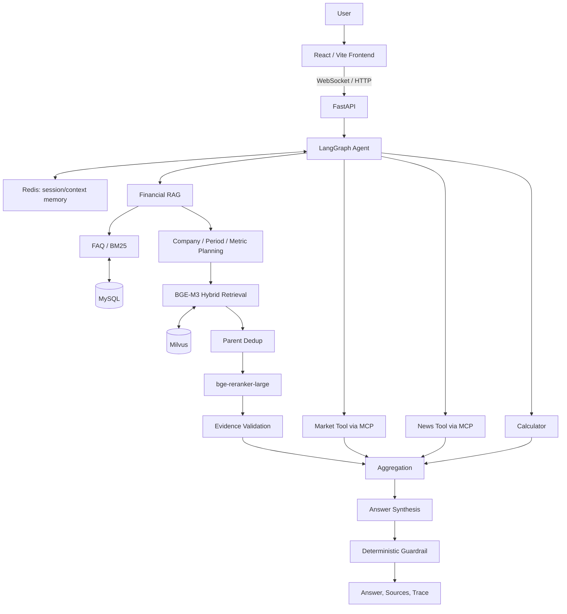

# Financial Agentic RAG

> A股上市公司财报智能问答 Agent

面向 A 股财报研究的单 Agent、多工具应用。它把冻结财报语料中的检索问答，与实时行情、财经新闻、确定性计算和多轮会话上下文放进同一条可观测链路：先确定用户到底在问哪家公司、哪个报告期和什么指标，再按证据边界回答，而不是把相似财报片段直接交给模型猜结论。

## Online Demo

[https://jinxi-ai.com](https://jinxi-ai.com) - Interactive Financial Agent Demo（GPU目前处于关闭状态）

## Why This Project

财报问答的难点不只是“找到相似文本”。在多公司、多报告期查询中，普通 TopK 向量检索很容易把正确指标带到错误公司或错误期间：例如同一公司的半年报与年报文字高度相似，或两家公司都披露了相同指标。

本项目将查询中的公司、报告期和指标显式解析为可验证目标。对于多目标问题，系统按 `company × period` 定向检索并覆盖关键证据，最后才生成回答。这样把“检索命中”与“证据是否足以支持回答”分开处理，降低公司混淆、期间错配和数值幻觉。

## Key Features

- **面向财报的定向检索**：确定性提取公司、报告期与指标；多公司、多期间问题使用 `company × period` target planning。
- **Hybrid RAG**：BGE-M3 dense/sparse hybrid retrieval、Milvus、Parent-Child chunking、Parent dedup 和 `bge-reranker-large`。
- **结构化财务证据**：仅在公司、期间、指标和单位都明确时提取 verified values；差值、增长率与百分点变化由 deterministic calculator 完成。
- **Single Agent + multi-tool**：LangGraph 编排 Financial RAG、Market MCP、News MCP 与 Calculator，不是 Multi-Agent 或 A2A 架构。
- **多轮上下文**：RedisSaver 保存 thread session context；显式偏好使用隔离的 Redis namespace，普通提问不会隐式写入长期偏好。
- **安全降级与 Trace**：工具选择、工具执行和最终回答分层记录；外部数据失败时保留已验证结果并说明缺口，不编造价格、新闻或未验证计算。

## System Architecture



MCP 是 Market/News 外部能力的协议抽象；Redis、MySQL 和 Milvus 分别承担 session memory、FAQ 与向量检索职责。

## RAG Pipeline

```text
Query
  -> company / period / metric extraction
  -> company × period target planning
  -> target-scoped hybrid retrieval
  -> Parent dedup + rerank
  -> structured financial evidence
  -> verified calculation when applicable
  -> answer with provenance boundaries
```

简单问题保持简洁的 Top3 context；多公司、多期间或多指标问题在既有 reranked Parent pool 中优先覆盖每个明确 target 的证据，而不是全局提高 TopK。若某项基础证据不存在，系统不会用相邻期间或相似公司数字补全。

## Agent Workflow

```text
plan -> financial_rag -> market -> news -> calculator
     -> aggregation -> synthesis -> guardrail
```

Planner 选择实际需要的工具。单工具请求直接使用可信 Tool result；Composite query 才进行综合表达。Guardrail 以工具真实执行结果和可追溯 evidence 为准：当行情、新闻或计算没有 verified result 时，不允许最终回答自行补写。

## Supported Companies & Periods

当前数据范围为 **8 家 A 股公司、24 份冻结财报、3 个报告期**，并包含 150 条金融定义 FAQ：

| 公司 | 代码 |
|---|---:|
| 贵州茅台 | 600519 |
| 五粮液 | 000858 |
| 比亚迪 | 002594 |
| 宁德时代 | 300750 |
| 招商银行 | 600036 |
| 平安银行 | 000001 |
| 中芯国际 | 688981 |
| 北方华创 | 002371 |

报告期：`2025H1`、`2025FY`、`2026H1`。项目不宣称覆盖全部 A 股或任意历史报告。

## Evaluation

### 300-query frozen unseen-query holdout

300Q 是同一冻结财报语料上的 unseen-query holdout，不是 unseen-document benchmark。Baseline 与 Final 均使用相同 BGE-M3、Milvus、reranker 和 `RETRIEVAL_K=30` / `CANDIDATE_M=3`；Final 的差异是 company × period 多目标编排。

| Metric | Baseline | Final |
|---|---:|---:|
| Document Recall@3 | 83.4% | **94.6%** |
| Period Target Accuracy | 89.6% | **100%** |
| Wrong Period Rate | 25.4% | **0%** |

`Document Recall@3` 描述 required documents 的召回，不是通用 relevance score。

### 100-query RAGAS evaluation

相同分层 query、相同 `K=30/M=3`、FAQ bypass 的 Financial RAG-only 评测：

| Metric | Paired Baseline | Final |
|---|---:|---:|
| Faithfulness | 0.864 | **0.892** |
| Context Precision | - | **0.851** |

RAGAS 的 Context Precision 衡量返回 context 的相关性，不等价于多目标 Document Recall 或 coverage。

### 150-turn Agent benchmark

| Metric | Result |
|---|---:|
| Tool Selection Accuracy | 91.33% |
| Context Recovery | 97.44% |
| Tool Execution Success Rate | 100% |

Tool Execution Success Rate 指 **已调用工具** 的执行成功率，不表示 Agent 的总体准确率。评测将 Planner 选择、外部 Provider 执行、session memory 和最终安全降级分别统计。完整协议与分母见 [docs/EVALUATION.md](docs/EVALUATION.md)。

## Example Queries

```text
贵州茅台 2026H1 营业收入是多少？

贵州茅台 2026H1 营业收入是多少？然后它的股票怎么样？

贵州茅台 2026H1 营业收入是多少？然后他的股票怎么样，他的新闻呢

比较贵州茅台和五粮液 2025H1 的经营表现

3+4=多少，还有茅台的股票看看
```

支持财报问答、实时行情、财经新闻、确定性计算、composite query 与基于 thread 的多轮上下文恢复。

## Project Structure

```text
financial_agentic_rag/
├── app.py                 # FastAPI, health check, RAG and Agent streaming endpoints
├── new_main.py            # IntegratedQASystem
├── agent/                 # LangGraph orchestration, tools, memory, synthesis, guardrail
├── rag_qa/                # Retrieval, metadata, evidence and vector-store logic
├── mcp_servers/           # Market / News MCP servers and public providers
├── mysql_qa/              # FAQ import, MySQL access and BM25 cache
├── frontend/              # React / Vite streaming chat demo
├── evaluations/           # Frozen manifests, runners and scoring utilities
├── financial_data/        # FAQ and local financial-data documentation
├── docs/                  # Evaluation and API documentation
└── tests/                 # Focused unit and integration-style tests
```

## Quick Start

Python 3.10 is the baseline environment. Configure your own model, service endpoints and credentials locally.

```bash
git clone <YOUR_REPOSITORY_URL>
cd financial_agentic_rag
python3.10 -m venv .venv
source .venv/bin/activate
pip install -r requirements.txt
cp .env.example .env
cp config.example.ini config.ini
```

Set local MySQL, Redis, Redis Stack, Milvus, BGE-M3/reranker model paths and LLM settings in untracked configuration files. The frozen evaluation runtime uses `RETRIEVAL_K=30` and `CANDIDATE_M=3`.

```bash
uvicorn app:app --host 0.0.0.0 --port 8001
```

The React demo connects to `WS /api/agent/stream`. See [DEPLOYMENT.md](DEPLOYMENT.md) for a topology and placeholder-based deployment checklist.

## Deployment

The deployment boundary is intentionally explicit: frontend traffic reaches FastAPI through HTTPS, while RAG inference connects to separately managed MySQL, Redis/Redis Stack and Milvus services. `docker-compose.yml` provides an optional application container definition; it does not provision or publish real service credentials.

## Evaluation Reproducibility

- Frozen query manifests and deterministic evaluators are kept in `evaluations/`.
- 300Q evaluates retrieval/orchestration only; it does not invoke Market/News MCP.
- 100Q RAGAS uses Financial RAG-only capture, bypassing FAQ/MySQL to keep Baseline vs Final comparable.
- 150-turn Agent evaluation isolates benchmark Redis session and preference namespaces by run ID.
- Raw captures and local result files are intentionally ignored; publish summaries and reproducible scripts instead of credentials or large transient outputs.

## Notes & Limitations

- The corpus is intentionally limited to the eight listed companies and three report periods.
- Public Market/News providers can change availability or response formats; the Agent records failures and degrades safely.
- Multi-target coverage improves period correctness but adds retrieval and reranking latency.
- The system is a research-assistance tool, not investment advice.
