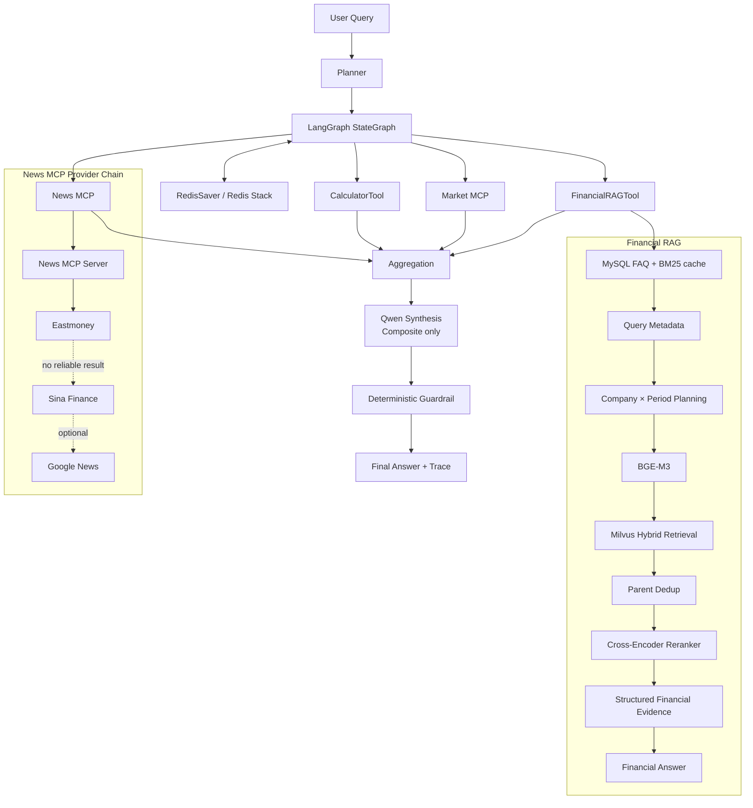

# Financial Agentic RAG

一个基于 LangGraph、Hybrid RAG、MCP Tools、Redis Memory 和确定性金融证据处理构建的多工具金融研究 Agent。它将冻结的 Financial RAG 封装为一个完整 Tool，并结合实时行情、财经新闻、确定性计算、多轮上下文和显式长期偏好完成金融信息查询与综合分析。

项目面向 AI 应用与 RAG/Agent 工程实践：重点不是替代投资决策，而是把历史披露、实时公开数据和可验证计算放进可观测、可评测、可降级的工程链路中。系统输出应作为研究辅助信息使用，并保留来源与失败状态供复核，便于审计与追溯。

项目将“检索命中”“工具计划”“provider 执行”“记忆恢复”和“最终表达”拆开观察：前一层成功不自动代表后一层可信，任一层失败也不会被静默包装成看似完整的答案。这种分层既便于定位线上问题，也让离线 benchmark 可以归因到检索、编排、外部服务或回答边界。

> 交互式 Web Demo 正在准备。未来界面将展示流式回答、Tool 执行状态、来源引用和可展开的 Agent Trace；预留截图路径为 `docs/images/demo.png`，当前不提供伪造截图。

## 核心亮点

- **多工具 Agent**：LangGraph 根据 Planner 的 `required_tools` 调用 Financial RAG、Market MCP、News MCP 与 Calculator，再聚合、综合和安全检查。
- **面向财报的 Hybrid RAG**：BGE-M3 dense + sparse retrieval、Milvus hybrid search、Parent-Child chunks、Parent deduplication 和 Cross-Encoder reranker。
- **多目标检索编排**：确定性识别公司与报告期间，为多公司/多期间问题生成 company × period targets，降低相似报告之间的串期风险。
- **可验证数值链路**：从 Parent 证据提取高置信财务值，使用确定性 calculator 计算差值、增长率或百分点变化；缺少 verified calculation 时禁止模型自行推导。
- **可恢复且隔离的记忆**：RedisSaver 保存 thread session state；长期偏好仅接受用户明确声明的公司或指标偏好，普通问题不会隐式写入。
- **部署问题闭环**：News MCP 从 Google News-only 调整为国内公开源优先与 fallback，冻结 Agent holdout 中 News 成功数从 `0/61` 变为 `61/61`。

## 问题与工程取舍

**相似报告容易串期。** 同一公司半年报、年报的文字高度相似，单纯依赖语义相似度会把正确公司但错误期间的证据带入回答。系统将明确的公司与期间转成独立 target，在既有候选池中优先保留每个 target 的证据；代价是多目标检索与 rerank 更慢，但换来可追溯的期间边界。

**工具可用性不是 Planner 正确性。** 中国 GPU 环境中 Google News 连接超时，首次 150-turn run 的新闻调用为 `0/61`。Provider 层改为东方财富主源、Sina Finance fallback、Google optional fallback 后，News 为 `61/61`、总体 Tool Execution 为 `100%`，而 Intent/Tool Selection 仍是 `91.33%`，因此可以明确归因于 Provider connectivity，而不是“调高了 Planner 分数”。

**回答必须有证据边界。** 财报、实时行情和新闻分别来自不同 Tool，Composite synthesis 只组织已验证内容；无法计算、来源缺失或外部工具失败时，系统宁可说明信息不足，也不把相邻期间数字、新闻摘要或投资倾向伪装成确定事实。

## 系统架构



完整源文件见 [docs/architecture.mmd](docs/architecture.mmd)。当前 FastAPI WebSocket 暴露的是 Financial RAG 流式链路；LangGraph Agent 通过 Python API 独立调用，尚未接入该 WebSocket UI。

## Financial RAG

`IntegratedQASystem.query()` 先走 MySQL FAQ fast path；明确公司、年份或报告的查询会绕过通用 FAQ，再由 Qwen Router、Query Metadata 和 StrategySelector 编排。检索链路为 BGE-M3 dense/sparse embedding → Milvus `WeightedRanker` hybrid search → Child 命中回收 Parent → Parent dedup → bge-reranker-large。

项目重点处理同一公司 `2025H1`、`2025FY`、`2026H1` 语义相近但统计口径不同的问题：

```text
query → company / period extraction → company × period targets
      → target-scoped retrieval → merge → rerank → evidence / calculation → answer
```

复杂问题不会把各 subquery 结果简单全局排序后取 Top3，而是在既有 reranked Parent pool 中优先覆盖 company × period × metric 证据，再按原分数补位。简单问题仍用 Top3；多目标问题仅按证据格动态扩大 context。Structured Financial Evidence 只接受公司、期间、指标和单位明确绑定的值，deterministic calculator 只基于 verified values 计算，Qwen 只负责表达。这降低了串期风险，也带来多目标查询的 latency 成本。

## Agent、MCP 与 Memory

`LangGraphFinancialAgent` 的真实节点链路为 `plan → financial_rag → market → news → calculator → aggregation → synthesis → guardrail`。Planner 根据 `required_tools` 决定节点是否执行；单 Tool 问题直接返回可信 Tool result，Composite Query 才调用 Qwen synthesis。Trace 分别保存 intent、skill、graph path、executed tools 和 Tool latency，不保存密钥或完整 Parent 文本。

报告查询还走确定性 `ReportCatalog` 分支：多份候选时要求选择年份，唯一匹配则直接返回报告信息；普通财务问题再进入 RAG。多公司、多期间问题保留 target bindings，不依赖数组位置猜测公司与期间的对应关系。

- **FinancialRAGTool**：复用 `IntegratedQASystem`，不复制 Milvus、embedding 或 reranker 实现。
- **Market MCP**：东方财富公开行情为主源，失败时使用 Tencent Finance public quote API fallback。
- **News MCP**：东方财富搜索为主源，Sina Finance 为 fallback，Google News 为可选 fallback；结果保留 source、published_at、URL 和 provider trace。轻量相关性排序优先公司主体，过滤仅代码命中的概念/资金流列表。
- **CalculatorTool**：本地确定性 `absolute_change`、`growth_rate`、`percentage_point_change` 与 `ratio`。
- **Memory**：RedisSaver 与 FAQ Redis 使用独立 Redis Stack 配置和 key prefix。session 记录公司、代码、报告期间、前序 query 与必要摘要；长期 preference 仅保存显式声明的 `preferred_companies`、`preferred_metrics`。

### Safety & Failure Handling

Planner 的“选择了工具”与 Tool 的“实际成功”分开记录，因此公开 provider 超时不会被误诊为 Planner 失败。Composite synthesis 要求财报、行情和新闻分段呈现；随后 deterministic Guardrail 拒绝未被 Tool 支持的价格、新闻和数值推导，并在失败时回退到可追溯的安全摘要。年度与半年度等不同统计期间必须提示口径差异，不能暗示同口径同比或环比。

## 冻结语料

当前语料为 **8 家 A 股公司 × 3 个报告期间 = 24 份财报**，期间为 `2025H1`、`2025FY`、`2026H1`：贵州茅台（600519）、五粮液（000858）、比亚迪（002594）、宁德时代（300750）、招商银行（600036）、平安银行（000001）、中芯国际（688981）、北方华创（002371）。

Milvus 使用 `financial.financial_rag_v1`；冻结入库快照为 5,845 个 Parent chunks、21,116 个 Child entities/chunks。FAQ 数据库包含 150 条定义型金融问答。

每份年报以标准文件名解析 `company_name`、`company_code`、`report_year`、`period_type` 与 `report_period`，并随 Original Document → Parent → Child 继承。Milvus 同时存储来源文件、稳定 `document_id`、`file_sha256`、`parent_id`、Parent content 与上述金融 metadata。检索结果会恢复这些 provenance 信息，因此 metadata filter、评测 required documents 和最终回答中的证据边界都能指回特定报告，而不是只依赖模型相似度。

## Evaluation

### 300Q RAG holdout

300Q 是在**相同冻结财报语料**上的 frozen unseen-query holdout，不是 unseen-document benchmark。Baseline 与 Final 固定使用相同 BGE-M3、Milvus、reranker、`RETRIEVAL_K=30`、`CANDIDATE_M=3` 和 evaluator；Final 的主要增量是 deterministic company × period multi-target orchestration。

| 指标 | Baseline | Final |
|---|---:|---:|
| Document Hit@3 | 95.56% | 100.00% |
| Required Document Coverage@3 | 83.36% | 94.63% |
| Period Target Accuracy | 89.63% | 100.00% |
| Wrong Period Rate | 25.37% | 0% |
| Multi-target Full Coverage@3 | 49.38% | 66.25% |

Company Target Accuracy 从 `98.89%` 小幅降至 `97.78%`，主要发生在复杂 3-4 company 问题。Final 的 Mean/P50/P95 latency 为 `16.59s / 12.68s / 48.76s`，高于 baseline 的 `6.38s / 4.85s / 17.28s`，反映了多 target retrieval 与 reranking 的成本。54 个 case 的 required documents 超过 Top3 容量，因此 strict Full Coverage@3 不可能达到 100%；在 `required_docs ≤ 3` 的 216 个可行 case 上，Final 为 `216/216`。

另有独立 60Q Gold v2 regression suite 用于开发期 routing、retrieval 与数值回答回归。详细方法、artifact 状态、分母和限制见 [docs/EVALUATION.md](docs/EVALUATION.md)。

### 150-turn Agent E2E

最终 Agent benchmark 使用 Domestic News Provider 的同一冻结 150-turn 数据集和 v1.1 离线 scoring protocol：

| 指标 | 结果 |
|---|---:|
| Intent Accuracy | 91.33% |
| Tool Selection Accuracy | 91.33% |
| Required Tool Coverage | 91.10% |
| Unnecessary Tool Call Rate | 0.63% |
| Tool Execution Success | 100.00% |
| Company Context Accuracy | 100.00% |
| Full Context Memory Recovery | 97.44% (38/39) |
| Thread Isolation | 100.00% (8/8) |
| Composite Completion | 75.00% (15/20) |

工具执行为 Financial RAG `70/70`、Market MCP `47/47`、News MCP `61/61`、Calculator `9/9`。Google News-only run 的 News 成功数为 `0/61`，修复后为 `61/61`；整体 Tool Execution `67.38% → 100%`，Mean latency `12.58s → 11.01s`。这项变化不改善 Planner：Intent 与 Tool Selection 均保持 `91.33%`。

150-turn 采用 run-specific `thread_id` 与 `user_id` namespace，避免 benchmark Redis checkpoint 或长期偏好污染手工会话和后续 run。评测将 session memory、thread isolation 与 explicit preference recovery 分别统计，而不会把 Market/News follow-up 没有携带历史财报期间误判为跨线程污染。Guardrail 仅对存在确定性 runtime flag 的案例评分，不能从最终文本关键词反推“安全”。

## 技术栈

| 层级 | 实际组件 |
|---|---|
| Web 与应用 | Python、FastAPI、Uvicorn、Pydantic |
| LLM 与编排 | Qwen OpenAI-compatible API、LangGraph、LangChain Core |
| Retrieval | BGE-M3、Milvus、dense + sparse hybrid retrieval、WeightedRanker、bge-reranker-large |
| 数据与缓存 | MySQL、Redis、Redis Stack、RedisSaver |
| Tool 协议 | MCP v2 stdio client/server、requests public providers |
| 评测与测试 | deterministic JSON evaluator、unittest |

模型和数据服务并不内嵌在仓库中：BGE-M3、reranker、财报 PDF、MySQL、Milvus、Redis 与 Redis Stack 均通过本地配置连接。评测 checkpoint 保存非敏感 runtime config；FAQ cache、Agent session checkpoint 和长期 preference 使用隔离的 Redis 配置/前缀。

## Quick Start

运行环境以 Python 3.10 为基线。复制配置样例并填入**自己的**服务地址、模型路径和密钥：

```bash
git clone <YOUR_REPOSITORY_URL>
cd financial_agentic_rag
python3.10 -m venv .venv
source .venv/bin/activate
pip install -r requirements.txt
cp .env.example .env
cp config.example.ini config.ini
```

在 `.env` 或本地 `config.ini` 中配置自己的服务地址、模型路径和密钥；`config.example.ini` 与 `.env.example` 只含占位符，禁止上传实际配置。`RETRIEVAL_K=30` 与 `CANDIDATE_M=3` 是冻结评测使用的环境覆盖值。

准备 MySQL、Redis、Redis Stack、Milvus 和本地 BGE-M3 / reranker 模型后，可启动 RAG Web 服务：

```bash
python app.py
# 或
uvicorn app:app --host 0.0.0.0 --port 8001
```

Docker Compose 当前只定义 `financial-app`，数据库、Milvus 和 Redis/Redis Stack 需作为可连接的外部服务提供。首次入库使用正式 ingestion CLI，处理 `financial_data` 下配置的 source 目录：

```bash
python -m rag_qa.main --data-processing
```

Agent 的稳定 Python 调用入口为：

```python
from agent.langgraph_agent import LangGraphFinancialAgent

agent = LangGraphFinancialAgent(
    checkpointer=LangGraphFinancialAgent.redis_checkpointer()
)
result = agent.run(
    "比较贵州茅台和五粮液2026H1营业收入，并看看最近新闻。",
    thread_id="demo-thread",
    user_id="demo-user",
)
print(result["final_answer"])
```

`app.py` 提供 RAG Web 服务接口：`POST /api/query` 用于 FAQ 快速路径，`WS /api/stream` 通过 `start → token → end` 事件流式返回 `IntegratedQASystem.query()` 的结果，`GET /health` 用于健康检查。Agent 当前没有单独的 HTTP/WebSocket endpoint；它通过上述 Python API 调用，避免在冻结 RAG Web 层中混入未完成的多工具 UI 行为。

## 示例问题

- 贵州茅台2026H1营业收入是多少？
- 比较比亚迪2025FY和2026H1经营现金流。
- 比较贵州茅台和五粮液2026H1营业收入。
- 比亚迪当前市场表现如何？
- 中芯国际最近有什么新闻？
- 从80增长到100，增长率是多少？
- 结合比亚迪2026H1财报、实时行情和近期新闻分析其经营表现。
- Turn 1：查平安银行2026H1营业收入。Turn 2：沿用这个报告期间，归母净利润呢？

## 项目结构

```text
financial_agentic_rag/
├── app.py                 # FastAPI 与 RAG WebSocket 入口
├── new_main.py            # IntegratedQASystem：FAQ、报告目录与 RAG 编排
├── agent/                 # LangGraph Agent、Tools、MCP client、Memory、Synthesis
├── rag_qa/core/           # Hybrid RAG、metadata、evidence、calculator、Milvus store
├── mysql_qa/              # FAQ 导入、MySQL 访问、BM25 与 Redis cache
├── mcp_servers/           # Market / News stdio MCP servers 与公开 provider
├── financial_data/        # 本地财报与 FAQ 数据说明
├── evaluations/           # 60Q、300Q、150-turn datasets、runner 与 scoring artifacts
├── tests/                 # focused unit / integration-style tests
└── docs/                  # 架构与评测说明
```

## 已知限制与 Roadmap

- Agent strict period state accuracy 为 `61% (61/100)`，其中 explicit period resolution 为 `53.45% (31/58)`，period carryover 为 `66.67% (2/3)`。
- Composite planning 为 `15/20`；部分财报 + 行情或财报 + 计算请求仍会漏掉一个 required tool。
- 多目标检索提升了跨公司/跨期间正确性，但增加了 latency。
- Market / News 使用公开 provider，接口可用性和返回格式可能变化。
- 语料目前只覆盖 8 家公司与 3 个报告期间；Guardrail 自动评测只覆盖有 deterministic runtime flags 的场景。

后续重点是 period normalization/carryover、Composite tool planning、多目标检索性能、guardrail observability、语料扩展和 streaming Web Demo。
