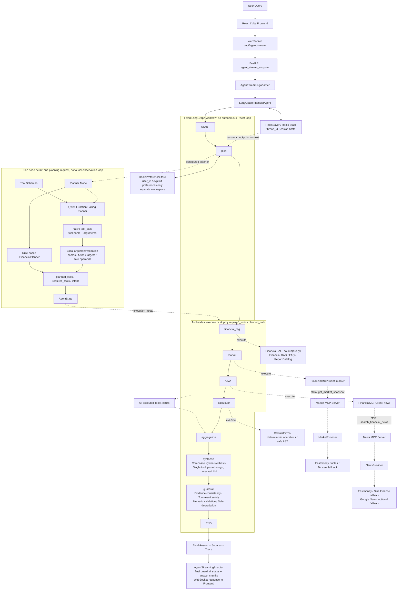

# Financial Agentic RAG

> A股上市公司财报智能问答 Agent

面向 A 股财报研究的单 Agent、多工具应用。它把冻结财报语料中的检索问答，与实时行情、财经新闻、确定性计算和多轮会话上下文放进同一条可观测链路：先确定用户到底在问哪家公司、哪个报告期和什么指标，再按证据边界回答，而不是把相似财报片段直接交给模型猜结论。

## Online Demo

[https://jinxi-ai.com](https://jinxi-ai.com) - Interactive Financial Agent Demo（GPU 按需运行，演示可用性取决于实例状态）

## Why This Project

财报问答的难点不只是“找到相似文本”。在多公司、多报告期查询中，普通 TopK 向量检索很容易把正确指标带到错误公司或错误期间：例如同一公司的半年报与年报文字高度相似，或两家公司都披露了相同指标。

本项目将查询中的公司、报告期和指标显式解析为可验证目标。对于多目标问题，系统按 `company × period` 定向检索并覆盖关键证据，最后才生成回答。这样把“检索命中”与“证据是否足以支持回答”分开处理，降低公司混淆、期间错配和数值幻觉。

## Key Features

- **面向财报的定向检索**：确定性提取公司、报告期与指标；多公司、多期间问题使用 `company × period` target planning。
- **Hybrid RAG**：BGE-M3 dense/sparse hybrid retrieval、Milvus、Parent-Child chunking、Parent dedup 和 `bge-reranker-large`。
- **结构化财务证据**：仅在公司、期间、指标和单位都明确时提取 verified values；差值、增长率与百分点变化由 deterministic calculator 完成。
- **Single Agent + multi-tool**：LangGraph 编排 Financial RAG、Market MCP、News MCP 与 Calculator，不是 Multi-Agent 或 A2A 架构。
- **一次性 Function Calling 规划**：支持 Rule / Qwen Function Calling 两种 Planner；原生 `tool_calls` 经本地参数校验后写入 AgentState，由固定 LangGraph workflow 执行。
- **多轮上下文**：RedisSaver 保存 thread session context；显式偏好使用隔离的 Redis namespace，普通提问不会隐式写入长期偏好。
- **安全降级与 Trace**：工具选择、工具执行和最终回答分层记录；外部数据失败时保留已验证结果并说明缺口，不编造价格、新闻或未验证计算。

## System Architecture

以下按 `agent-fc-v1.1` 的实际源码绘制；顶层图与 [docs/architecture.mmd](docs/architecture.mmd) 完全一致。实线表示请求或固定节点顺序，虚线表示节点内部调用、状态依赖或结果汇集，不是 conditional routing。



**React != ReAct**：React / Vite 是前端技术。Function Calling 用于一次规划式 Tool Selection；后续 Tool Execution 由固定 LangGraph workflow 负责。不存在 `LLM → Tool → Observation → LLM → Tool` 的自主 ReAct 循环，也不是 Multi-Agent。

- `AGENT_PLANNER_MODE=rule` 使用规则 Planner；`function_calling` 使用 Qwen 原生工具调用。源码默认仍是 `rule`，v1.1 严格验收配置为 `function_calling`、`qwen3.8-max`、`AGENT_PLANNER_FALLBACK_TO_RULE=false`。
- FC 每轮规划最多一次模型请求，SDK 自动重试关闭；整份计划先校验再执行。Market/News 的同名多目标调用保存在 `planned_calls`，由对应节点逐条消费，而不是改变 Graph 边。无工具计划或校验失败会返回说明/澄清；Rule fallback 仅在显式配置启用时使用。
- Agent 只有四类工具：Financial RAG、Market MCP、News MCP、Calculator。FAQ / BM25 / MySQL 是 Financial RAG 内部 fast path，不是第五个 Agent Tool。MCP 通过本地子进程的 **stdio** 通信，Provider 再访问外部行情/新闻来源。

## RAG Pipeline

实际入口为 `FinancialRAGTool.run()` → `IntegratedQASystem.query()` → `rag_qa/core/new_rag_system.py` 中的 `RAGSystem.generate_answer()`；目录中保留的旧 `rag_system.py` 不是这条线上请求链的入口。

```mermaid
flowchart TB
    FRT["FinancialRAGTool.run(query)"] --> IQ["IntegratedQASystem.query()"]
    IQ --> QM["extract_query_metadata<br/>company / period / metric extraction<br/>build candidate SubQueryTargets"]
    QM --> FAQ["FAQ gate / BM25 / MySQL fast path<br/>FAQ Redis cache; company/report queries bypass matching"]
    FAQ -->|"FAQ hit"| DIRECT["Direct tool answer"]
    FAQ -->|"miss or bypass"| LOOKUP{"REPORT_LOOKUP?"}
    LOOKUP -->|"yes"| CATALOG["ReportCatalog<br/>available reports / period clarification"]
    CATALOG --> DIRECT
    LOOKUP -->|"no: need_rag"| CHOOSE{"Deterministic subqueries required?"}

    subgraph TARGET["Inside Financial RAG: Company x Period Target Planning"]
        CHOOSE -->|"yes"| PLAN["QueryMetadata.subquery_plan()<br/>Target 1 / Target 2 / ...<br/>query + company/period metadata filter"]
        PLAN --> PIN["Pass explicit subquery strategy + targets<br/>bypass StrategySelector and LLM subquery generation"]
    end
    CHOOSE -->|"no"| UNSET["No preset strategy<br/>single/global metadata filter"]
    PIN --> RAG["RAGSystem.generate_answer()"]
    UNSET --> RAG
    RAG --> ROUTER["FinancialQueryRouter"]
    ROUTER -->|"OUT_OF_SCOPE"| SAFE["Safe no-context response"]
    ROUTER -->|"RAG or conservative fallback"| PRESET{"Explicit strategy + targets?"}
    PRESET -->|"yes"| TARGETS["_retrieve_with_subqueries<br/>consume deterministic targets"]
    PRESET -->|"no"| SS["StrategySelector: LLM retrieval strategy"]
    SS --> STRATEGY["Direct / HyDE / Subquery / Backtracking"]
    STRATEGY --> GENERIC["Original or LLM-rewritten query/subqueries<br/>retain applicable metadata filters"]
    TARGETS --> FILTER["Per-target metadata filter<br/>company_code / report_period<br/>only extracted constraints"]

    subgraph RETRIEVAL["Shared retrieval pipeline; repeated per target when applicable"]
        FILTER --> EMB["BGE-M3 query embedding<br/>batch embedding for subqueries"]
        GENERIC --> EMB
        EMB --> VEC["Dense + Sparse vectors"]
        VEC --> HYBRID["Milvus Hybrid Search<br/>metadata filters on both ANN requests"]
        HYBRID --> WEIGHT["WeightedRanker fusion<br/>dense 0.7 / sparse 1.0"]
        WEIGHT --> CHILD["Top-K Child Candidates"]
        CHILD --> PARENT["Parent Recovery"]
        PARENT --> DEDUP["Parent Dedup"]
        DEDUP --> RERANK["bge-reranker-large / CrossEncoder<br/>per-query parent rerank when needed"]
        RERANK --> MERGE["Merge ranked Parent pools<br/>coverage-first merge for subqueries"]
        MERGE --> COVER["target x metric coverage-aware selection<br/>M=3 base evidence budget"]
    end

    COVER -->|"no context"| SAFE
    COVER -->|"selected Parents"| STRUCT["Structured Financial Evidence<br/>company + period + metric + unit + source_parent"]
    STRUCT --> VERIFIED["Verified Evidence<br/>reject conflicting values; normalize units"]
    VERIFIED --> CALC["Deterministic Financial Calculation<br/>only for requested, verified comparable inputs"]
    CALC --> PROMPT["Answer Prompt<br/>Parent texts + verified evidence/provenance<br/>calculation note + missing-evidence constraints"]
    COVER -. "selected Parent texts" .-> PROMPT
    PROMPT --> QWEN["Qwen Financial Answer"]
    DIRECT --> RESULT["FinancialRAGToolResult.answer"]
    SAFE --> RESULT
    QWEN --> RESULT
```



**多目标拆分在 Financial RAG 内部，不在外层 FC Planner。** `extract_query_metadata()` 构造候选 targets，`IntegratedQASystem.query()` 根据 `requires_deterministic_subqueries()` 决定是否传入 `subquery_plan()` 和显式子查询策略。进入 RAG 后仍先经过 `FinancialQueryRouter`；只有允许检索才执行 targets。该分支不调用 `StrategySelector`，也不让 LLM 重新生成公司/期间子查询。未提供显式策略的分支才选择 Direct、HyDE、LLM Subquery 或 Backtracking。

多公司、单一明确期间且未指定指标的 broad comparison，会在 metadata 层按公司展开营业收入、归母净利润、经营活动现金流量净额。精确指标查询不做这种 broad expansion；所有 target 的检索保留各自 metadata filter。多目标路径批量编码 query，但仍逐 target 执行过滤后的 hybrid search 和 Parent rerank。

冻结 benchmark 使用 **K=30、M=3 base evidence budget**，不是理论最优参数，也不是所有请求只能有三个 Parent。`_select_context_docs()` 在既有 reranked pool 内优先满足 target × metric 覆盖，并按查询规模使用有上限的 context budget；缺失证据不能靠增加预算自动补齐。

Structured/Verified Evidence 绑定公司、期间、指标、单位与 `source_parent`，冲突数值不进入 verified block。RAG 内部 deterministic calculator 仅对满足条件的同一公司、两个同类型期间及已验证输入计算差值/增长率/百分点；与外层处理用户已给数字的 `CalculatorTool` 是两层不同能力。Parent 原文、verified block、计算结果或缺证据约束共同进入财报回答 Prompt。

## Agent Workflow

```text
START -> plan -> financial_rag -> market -> news -> calculator
      -> aggregation -> synthesis -> guardrail -> END
```

每次调用都沿上述固定边前进；不在 `required_tools` 中的工具节点直接跳过工作，不存在 Planner 用 conditional edge 跳到某个 Tool 的路径。

- **Aggregation**：汇集本轮 Tool Results；单工具结果使用原回答或确定性格式化，Composite 先形成安全摘要。
- **Single tool**：仍经过 `synthesis` 节点，但只透传 `draft_answer`，不额外调用 Agent-level Qwen synthesis，然后进入 Guardrail。Financial RAG 内部自己的 LLM 调用不属于这次省略的 synthesis。
- **Composite**：将 normalized Financial result、行情、新闻、计算结果、可用性、错误与 session context 交给 `QwenSynthesizer`；失败时保留安全摘要。
- **Guardrail**：确定性检查 evidence consistency、tool-result safety、numeric validation，并在必要时改用安全摘要。金额按语义类型/单位比较，显式近似金额使用受限容差；不支持的数字仍会被拒绝。规则有适用范围，不保证零幻觉；当前跨工具数值支持检查以成功的 Financial RAG result 为入口。
- **Streaming**：React 的 `useAgentStream` 使用 `new WebSocket(...)` 连接 `/api/agent/stream`。执行期间发送 `start / plan / tool_start / tool_end / synthesis_start`，完成后按最终 State 发送 `guardrail / sources / trace / token / end`，异常发送 `error`。`guardrail` 的公开状态来自最终结果，映射为 `passed / degraded / error`，不是“节点执行成功”。

**最终答案不是 Qwen 原生 token 直传。** `FinancialRAGTool` 先收集内部 RAG 输出，Agent-level synthesis 使用 `stream=False`；Guardrail 完成后，`AgentStreamingAdapter` 才将最终答案分块发送为 `token` 事件。原有 HTTP `/api/query` 和旧 WebSocket `/api/stream` 仍存在，但不是 React Agent Demo 的主链路。

### Memory boundaries

`thread_id` 作为 LangGraph checkpoint key，由 **RedisSaver / Redis Stack** 恢复 AgentState；恢复后的公司、期间和上一轮问题交给 Planner，用于本轮规划，而不是“Qwen 自己记住了上一轮”。Web 入口显式注入 RedisSaver；`InMemorySaver` 保留为未注入 checkpointer 时的本地/测试默认。

长期偏好由 **RedisPreferenceStore** 按 `user_id` 单独存储，只写入显式 `preferred_companies / preferred_metrics`，与 session checkpoint 使用不同 prefix。FAQ Redis cache 也不是 Agent session memory。当前输入中的显式目标优先于 session 目标；偏好不是擅自增加公司目标的授权。

### Source map

| 层级 | 实际入口与实现 |
|---|---|
| WebSocket / final events | [app.py](app.py) `agent_stream_endpoint` / `get_agent_stream_adapter`；[agent/streaming.py](agent/streaming.py) `AgentStreamingAdapter.iter_events` |
| Fixed Graph / Aggregation / Guardrail | [agent/langgraph_agent.py](agent/langgraph_agent.py) `LangGraphFinancialAgent._build_graph` / `_aggregation` / `_guardrail` |
| Tool Selection / validated calls | [agent/function_calling_planner.py](agent/function_calling_planner.py) `FunctionCallingPlanner.plan`；[agent/planning.py](agent/planning.py) `tool_schemas` / `validate_arguments`；[agent/planner.py](agent/planner.py) `FinancialPlanner` |
| Financial RAG integration | [agent/tools/financial_rag_tool.py](agent/tools/financial_rag_tool.py) `FinancialRAGTool.run`；[new_main.py](new_main.py) `IntegratedQASystem.query` |
| Target planning / retrieval orchestration | [rag_qa/core/query_metadata.py](rag_qa/core/query_metadata.py) `extract_query_metadata` / `QueryMetadata.subquery_plan`；[rag_qa/core/new_rag_system.py](rag_qa/core/new_rag_system.py) `RAGSystem` |
| Hybrid / evidence / calculations | [rag_qa/core/vector_store.py](rag_qa/core/vector_store.py) `VectorStore`；[rag_qa/core/financial_evidence.py](rag_qa/core/financial_evidence.py) `extract_verified_evidence`；[rag_qa/core/financial_calculator.py](rag_qa/core/financial_calculator.py) `build_calculation_note` |
| MCP / session-independent preferences | [agent/mcp_client.py](agent/mcp_client.py) `FinancialMCPClient`；[mcp_servers/](mcp_servers/)；[agent/preferences.py](agent/preferences.py) `RedisPreferenceStore` |

## Supported Companies & Periods

当前数据范围为 **8 家 A 股公司、24 份冻结财报、3 个报告期**，并包含 150 条金融定义 FAQ：

| 公司 | 代码 |
|---|---:|
| 贵州茅台 | 600519 |
| 五粮液 | 000858 |
| 比亚迪 | 002594 |
| 宁德时代 | 300750 |
| 招商银行 | 600036 |
| 平安银行 | 000001 |
| 中芯国际 | 688981 |
| 北方华创 | 002371 |

报告期：`2025H1`、`2025FY`、`2026H1`。项目不宣称覆盖全部 A 股或任意历史报告。

## Evaluation

### 300-query frozen unseen-query holdout

300Q 是同一冻结财报语料上的 unseen-query holdout，不是 unseen-document benchmark。Baseline 与 Final 均使用相同 BGE-M3、Milvus、reranker 和 `RETRIEVAL_K=30` / `CANDIDATE_M=3`；Final 的差异是 company × period 多目标编排。

| Metric | Baseline | Final |
|---|---:|---:|
| Document Recall@3 | 83.4% | **94.6%** |
| Period Target Accuracy | 89.6% | **100%** |
| Wrong Period Rate | 25.4% | **0%** |

`Document Recall@3` 描述 required documents 的召回，不是通用 relevance score。

### 100-query RAGAS evaluation

相同分层 query、相同 `K=30/M=3`、FAQ bypass 的 Financial RAG-only 评测：

| Metric | Paired Baseline | Final |
|---|---:|---:|
| Faithfulness | 0.864 | **0.892** |
| Context Precision | - | **0.851** |

RAGAS 的 Context Precision 衡量返回 context 的相关性，不等价于多目标 Document Recall 或 coverage。

### 150-turn Agent benchmark

以下保留的是 Function Calling 引入前、Rule Planner + Domestic News 的已冻结端到端结果，不是 v1.1 Function Calling Planner 的新一轮 E2E 分数。

| Metric | Result |
|---|---:|
| Tool Selection Accuracy | 91.33% |
| Context Recovery | 97.44% |
| Tool Execution Success Rate | 100% |

Tool Execution Success Rate 指 **已调用工具** 的执行成功率，不表示 Agent 的总体准确率。评测将 Planner 选择、外部 Provider 执行、session memory 和最终安全降级分别统计。完整协议与分母见 [docs/EVALUATION.md](docs/EVALUATION.md)。

## Example Queries

```text
贵州茅台 2026H1 营业收入是多少？

贵州茅台 2026H1 营业收入是多少？然后它的股票怎么样？

贵州茅台 2026H1 营业收入是多少？然后他的股票怎么样，他的新闻呢

比较贵州茅台和五粮液 2025H1 的经营表现

3+4=多少，还有茅台的股票看看
```

支持财报问答、实时行情、财经新闻、确定性计算、composite query 与基于 thread 的多轮上下文恢复。

## Project Structure

```text
financial_agentic_rag/
├── app.py                 # FastAPI, health check, RAG and Agent streaming endpoints
├── new_main.py            # IntegratedQASystem
├── agent/                 # LangGraph orchestration, tools, memory, synthesis, guardrail
├── rag_qa/                # Retrieval, metadata, evidence and vector-store logic
├── mcp_servers/           # Market / News MCP servers and public providers
├── mysql_qa/              # FAQ import, MySQL access and BM25 cache
├── frontend/              # React / Vite streaming chat demo
├── evaluations/           # Frozen manifests, runners and scoring utilities
├── financial_data/        # FAQ and local financial-data documentation
├── docs/                  # Evaluation and API documentation
└── tests/                 # Focused unit and integration-style tests
```

## Quick Start

Python 3.10 is the baseline environment. Configure your own model, service endpoints and credentials locally.

```bash
git clone <YOUR_REPOSITORY_URL>
cd financial_agentic_rag
python3.10 -m venv .venv
source .venv/bin/activate
pip install -r requirements.txt
cp .env.example .env
cp config.example.ini config.ini
```

Set local MySQL, Redis, Redis Stack, Milvus, BGE-M3/reranker model paths and LLM settings in untracked configuration files. The frozen evaluation runtime uses `RETRIEVAL_K=30` and `CANDIDATE_M=3`.

To use the v1.1 strict Function Calling path, set `AGENT_PLANNER_MODE=function_calling`, `AGENT_PLANNER_MODEL=qwen3.8-max`, `LLM_MODEL=qwen3.8-max` and `AGENT_PLANNER_FALLBACK_TO_RULE=false` in your local environment. The shipped example defaults to Rule mode; copying it alone does not enable Function Calling. Supply your own DashScope credentials without committing them.

```bash
uvicorn app:app --host 0.0.0.0 --port 8001
```

The React demo connects to `WS /api/agent/stream`. See [DEPLOYMENT.md](DEPLOYMENT.md) for a topology and placeholder-based deployment checklist.

## Deployment

The deployment boundary is intentionally explicit: the React/Vite Agent Demo uses WSS through the existing public proxy/tunnel to FastAPI `WS /api/agent/stream`, then `AgentStreamingAdapter` and `LangGraphFinancialAgent`. HTTP endpoints remain available separately. RAG inference connects to separately managed MySQL, Redis/Redis Stack and Milvus services; Market/News MCP servers are local stdio subprocesses, not separately deployed MCP HTTP services. `docker-compose.yml` provides an optional application container definition; it does not provision or publish real service credentials.

## Evaluation Reproducibility

- Frozen query manifests and deterministic evaluators are kept in `evaluations/`.
- 300Q evaluates retrieval/orchestration only; it does not invoke Market/News MCP.
- 100Q RAGAS uses Financial RAG-only capture, bypassing FAQ/MySQL to keep Baseline vs Final comparable.
- 150-turn Agent evaluation isolates benchmark Redis session and preference namespaces by run ID.
- Raw captures and local result files are intentionally ignored; publish summaries and reproducible scripts instead of credentials or large transient outputs.

## Notes & Limitations

- The corpus is intentionally limited to the eight listed companies and three report periods.
- Public Market/News providers can change availability or response formats; the Agent records failures and degrades safely.
- Multi-target coverage improves period correctness but adds retrieval and reranking latency.
- The system is a research-assistance tool, not investment advice.
